[TOC]

# Description

## 0.TITLE

### 媒体库管理系统设计

摘要：此次课程设计对媒体库管理系统的需求进行分析，对程序的目的及要求、内容及设计进行了详细阐述，随后进行小结。本媒体库管理系统通过C++来实现，采用显示菜单->用户键入->程序反馈的方式，完成了人机交互设计。经过多次优化调整，该程序具有人机界面友好、稳定、多平台兼容等优点。
*关键词：媒体库管理系统；C++；人机交互*

### Media library management system design

Abstract：This course design analyzes the requirements of the media library management system, elaborates on the purpose and requirements of the program, its content and design, followed by a short summary. This media library management system is implemented by C++, and the human-computer interaction design is completed by displaying the menu -> user keying -> program feedback. After several optimization and adjustment, the program has the advantages of friendly human-machine interface, stability and multi-platform compatibility.
*Key words：Media Library Management System; C++; Human-Computer Interaction*

## 1.目的及要求

### 1.1设计目的

此次设计模拟解决了一个现实问题：图书馆有很多资料，需要分类并对其资料流通进行管理。本次设计通过一个媒体库管理系统来解决此问题。

### 1.2开发与测试环境

#### 1.2.1开发环境

MacOS Catalina 10.15.7:Version 12.2(12B45b)

#### 1.2.2测试环境

平台1:MacOS Catalina 10.15.7:Version 12.2 (12B45b)
平台2:Windows 7 旗舰版:Red Panda Dev-C++ 6.5(编译器:MinGW GCC10.2.0 32-bit Debug)
平台3:Linux thekali 5.9.0-kali5-amd64 x86_64 GNU/Linux(g++ (Debian 10.2.1-3) 10.2.1)

### 1.3问题描述

图书馆中资料很多，如果能分类对其资料流通进行管理，将会带来很多方便，因此需要有一个媒体库管理系统。
图书馆有三大类物品资料：图书、视频光盘、图画。
这三类物品共同具有的属性有：编号、标题、作者、评级（未评级、一般、成人、儿童）等。其中图书类增加出版社、ISBN号、页数等信息；视频光盘类增加出品者的名字、出品年份和视频时长等信息；图画类增加出品国籍、作品的长和宽（以厘米记，整数）等信息。
媒体库管理系统要能实现增、删、改、查、读、存、打印等操作。

## 2.内容及设计

### 2.1概要设计

#### 2.1.1设计思路

> **类：**
> 因三大类物品具有共性，易想到将共性写在一个基类item中，将图书、视频光盘、图画作为item的派生类，以提高代码的可重用性，简化代码。根据1.3问题描述中的“增删查改”功能，容易想到，需要对多个对象进行操作。因此，需要有一个特殊类library，用于存放各个对象。

> **函数：**
> 为了实现人机交互功能，系统需要有输入与反馈功能。其中，输入流负责参数的键入，实现了增、删、查、改等基本操作；而输出流负责数据的打印，实现了系统的反馈功能。存、读操作对应了对文件的写入与读取，为了提高程序的交互性，考虑在之后的代码设计中加入更多细节，以允许用户通过输入的文件名，自定义读、存文件。
> 鉴于不同类有不同性质，对不同类的方法，在继承基类的基础上，进行了不同拓展。同时，为了方便管理图书、视频光盘、图画的对象，将管理方法写入library对象，以方便对对象进行操作。人机交互的函数则写在类外，用于接受用户的键入，并根据键入调用对特定对象的具体操作函数。

#### 2.1.2功能模块

> （1）添加物品：主要完成图书馆三类物品信息的添加，要求编号唯一。当添加了重复编号时，则提示数据添加重复并取消添加；当物品库已满，则提示不能再添加新的数据。 
> （2）查询物品：
> 可按三种方式查询物品，分别为：
> 按标题查询：输入标题，输出所查询的信息，若不存在该记录，则提示“该标题不存在！”；
> 按编号查询：输入编号，输出所查询的信息，若不存在该记录，则提示“该编号不存在！”；
> 按类别查询：输入类别，输出所查询的信息，若不存在该记录，则提示“该该类别没有物品！”。
> （3）显示物品库：输出当前物品库中所有物品信息，每条记录占一行。
> （4）编辑物品：可根据查询结果对相应的记录进行修改。修改时注意编号的唯一性。
> （5）删除物品：主要完成图书馆物品信息的删除。如果当前物品库为空，则提示“物品库为空！”，并返回操作；否则，输入要删除的编号，根据编号删除该物品的记录，如果该编号不在物品库中，则提示“该编号不存在！”。
> （6）统计信息：输出当前物品库中总物品数，以及按物品类别统计当前物品库中各类别的物品数并显示。
> （7）物品存盘：将当前程序中的物品信息存入文件中。
> （8）读取物品：从文件中将物品信息读入程序。

#### 2.1.3界面的组织和设计

整体设计（图2-1）

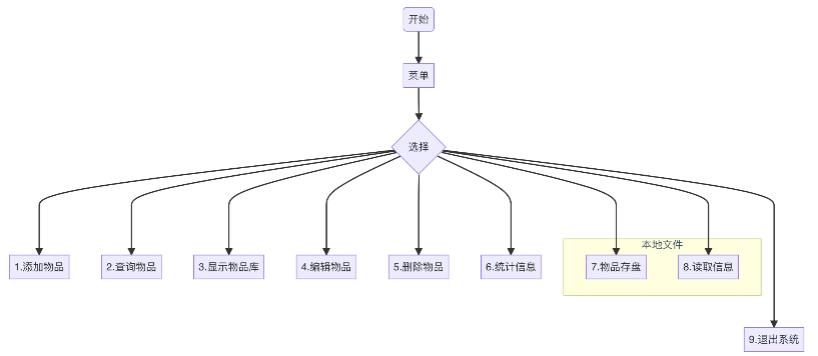

菜单界面（图2-2）

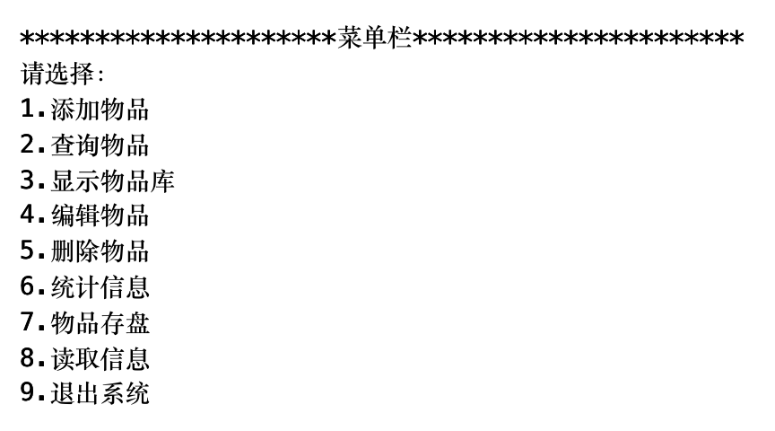

### 2.2详细设计

#### 2.2.1编译预处理

头文件及宏定义如下表所示。

| #include<fstream>  |
| ------------------ |
| #include<iostream> |
| #include<sstream>  |
| #include<cstring>  |
| #define max 1000   |

#### 2.2.2类的描述

item类（基类），其派生类分别为book、cd、drawing
library类，用于存放book、cd、drawing的对象
不同对象及它们的主要属性图如图2-3。

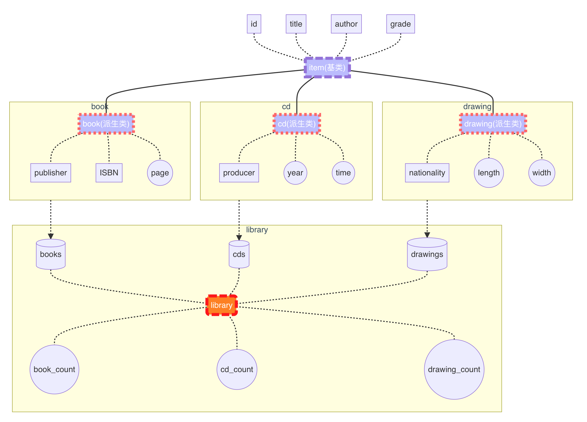

### 2.3软件测试

#### 2.3.1Xcode测试

假设本地已有存盘data.txt，现依次进行显示物品库->输入错误选项->读取a.txt->返回->读取data.txt->显示物品库操作，其结果如图2-4-1、2-4-2所示。

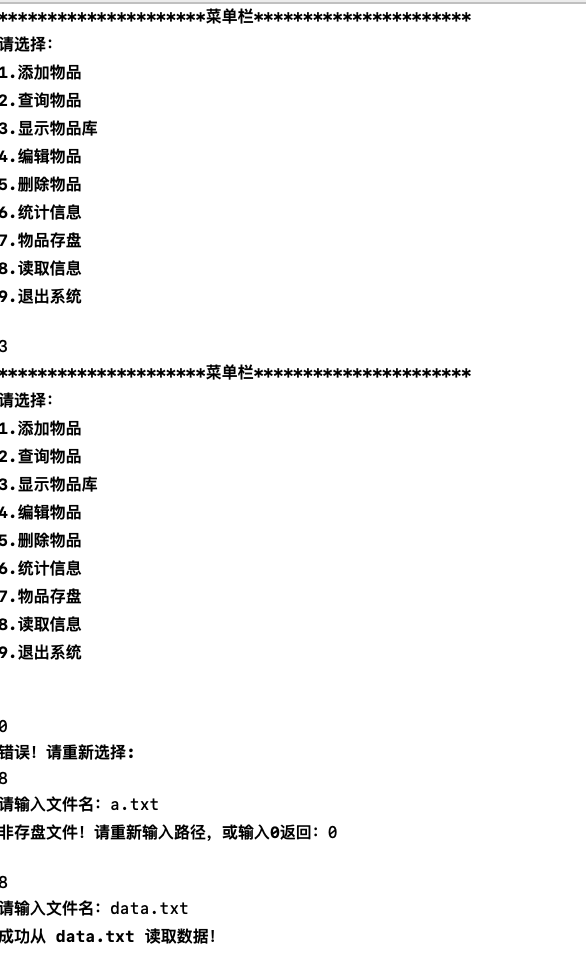

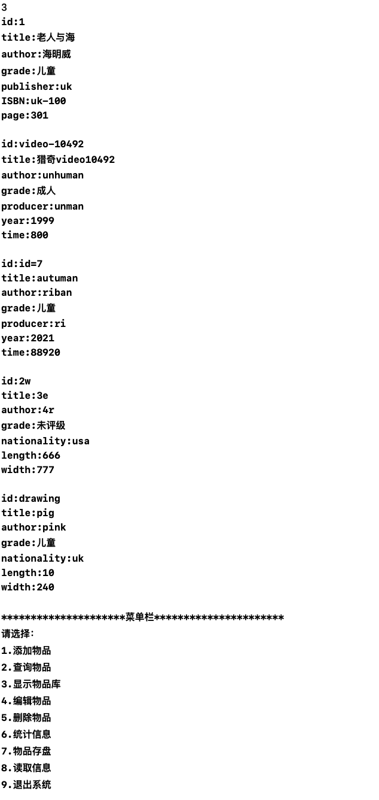
假设现在是第一次使用本程序。
依次执行以下任务：添加一个book->添加一个cd->添加一个drawing->将所添加的drawing的编号改为cd的编号->将所添加的drawing的编号改为一个不与先前物品重复的编号。程序运行结果如图2-4-3、2-4-4、2-4-5、2-4-6所示。

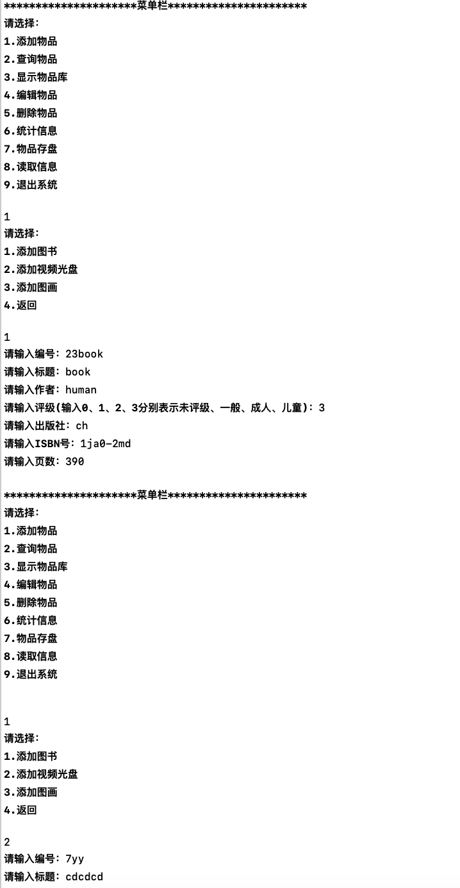

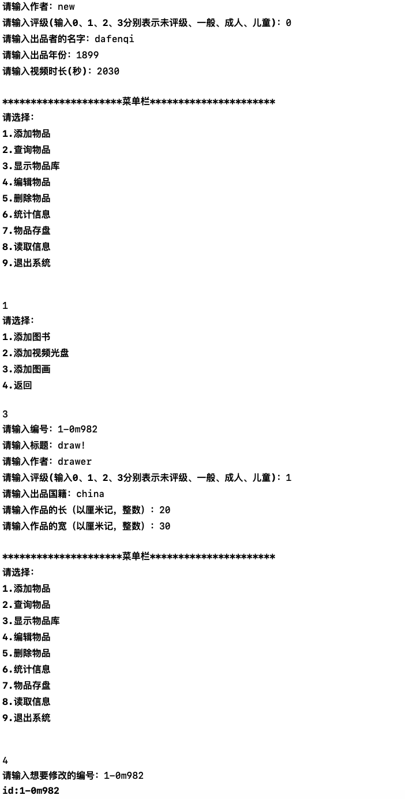

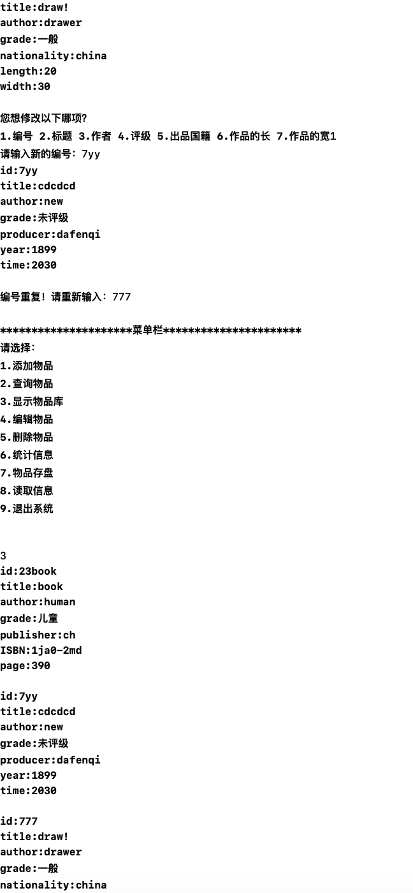

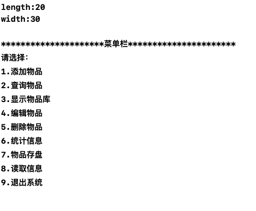

在此基础上依次进行如下操作：键入一个不存在的编号删除物品->再删除编号为777的物品->统计信息->查询编号为23book的物品。结果如图2-4-7、2-4-8所示。

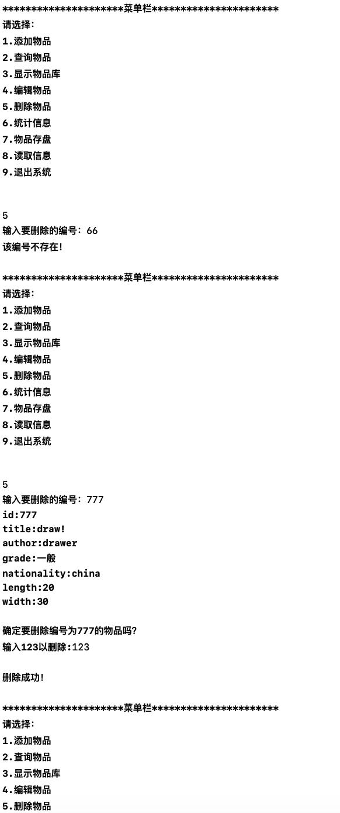

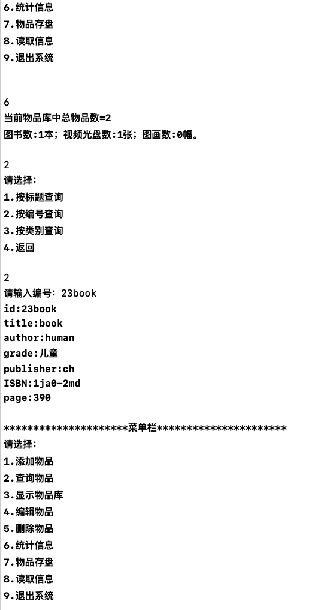

2.3.2细节方面
头文件`#include<cstring>`解决了windows系统无法调用某些函数的问题。
流的引入，使得读取存盘时可以将字符串转换为整型。
存盘时，会先写入`<!DOCTYPE 媒体库存盘>`，再存入book、cd、drawing数目。在读盘时，会先检测是否有`<!DOCTYPE 媒体库存盘>`，若有，则目标文件符合格式，进行近一步读取，在读取book、cd、drawing数目后，根据数目的不同进行更加精确的读取。

## 3.3辅助说明

当前目录已有data.txt文件，可作为测试存盘使用。

---

---

---

# Structure

> ## 头文件
>
> \#include <fstream>
>
> \#include <iostream>
>
> \#include <sstream>
>
> \#include <cstring>

> ## 宏定义
>
> \#define max 1000

> ## 枚举类型/结构体
>
> **enum** Grade

> ## 类
>
> > ### **类1：** *item*
> >
> > ##### 派生类：book、cd、drawing
>
> *将item作为基类，是为了简化代码重复
>
> > ### **类2：** *library*
> >
> > 用于存放book、cd、drawing的对象
> >
> > 

> ## 函数
>
> **void** menu()									//显示主菜单
>
> **int** choice(**int** number,library &l)	//选择
>
> **void** add(library &l)						//对应“1.添加物品”选项
>
> **void** query(library l)						//对应“2.查询物品“选项
>
> ​														//（library类的show()对应”3.显示物品库“选项）
>
> **void** edit(library &l)						//对应”4.编辑物品“选项
>
> **void** del(library &l)						//对应”5.删除物品“选项
>
> ​														//（library类的statistics()对应”6.统计信息“选项）
>
> ​														//（library类的save()对应”7.物品存盘“选项）
>
> ​														//（library类的load()对应”8.读取信息“选项）
>
> **int** choice(**int** number,library &l)	//作用：根据输入来调用函数
>
>  
>
> **int** main()										//main函数

不同对象及它们的主要属性

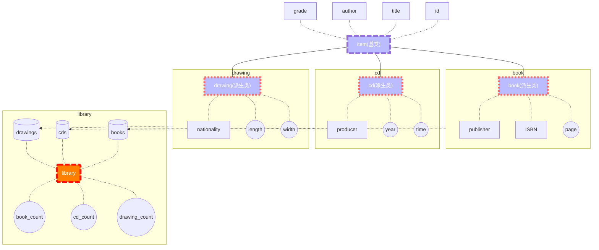

# BUG & improvement

版本1.0

> [BUG]1.修复了does_title_exist函数仅能匹配一个对象的信息的问题
>
> [优化]2.将choice的返回值类型由void改为int，以配合3.的调整
>
> [优化]3.main函数优化（新增int situation，用于判断choice返回值，若为1,2,3,4,5则调用菜单函数）
>
> [优化]4.对library::remove（删除物品核心函数）进行了完善（新增显示是否删除成功）
>
> [优化]5.删除void statistics(library &l)函数，同时在library类中新增成员void statistics()。两者作用相同。该修改旨在减少代码复杂性
>
> [BUG]6.引入#include <cstring>，修复了windows系统无法调用某些函数的问题
>
> [优化]7.将三个派生类book、cd、drawing的protect关键字改为了private
>
> [优化]8.修改了void library::save和void library::load的交互提示，附上更详细的注释，并在ss.clear()后加上ss.ignore()

版本1.1

> [BUG]1.删去ss.ignore()，修复了读取int类型出错的问题

版本1.2（2021/12/14）

> [BUG]1.library::does_title_exist()函数，其中的exist初值改为0，而不是无初始值
>
> [优化]2.移除了void display_repository(library l)函数。在int choice函数中，case 3直接调用l.show()而非display_repository(library l)，简化代码。
>
> [优化]3.听取老师建议，增加了void del(library &l)函数（负责5.删除物品选项）的【确认删除】选项，可防止误删操作。
>
> [windowsBUG??]4.移去了main函数参数列表里的参数，不然可能无法在windows上运行

> 参考文献：
>
> 郑莉，董渊. C++程序设计基础教程. 北京：清华大学出版社，2010.

